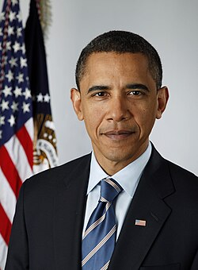
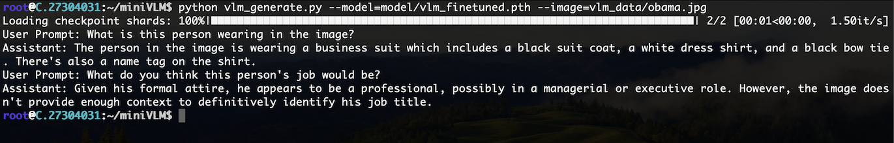

# miniVLM

A mini version of Vision-Language-Model (VLM) built from scratch, using purely pytorch code.

We first trained a CLIP model from scratch, and get the vision transformer encoder. We then connected the vision encoder with a Qwen2.5-3B-Instruct model, using a cross-attention adapter layer, and conducted two-stage training: pre-training and instruction fine-tuning. This gave us the final VLM chatbot

### CLIP Model Training

#### Code files

    root
    |___text_encoder.py         # the text encoder of the CLIP model, transformer architecture
    |___vision_transformer.py   # the vision encoder of the CLIP model, vision transformer architecture
    |___clip_model.py           # the CLIP model file that combines the previous two encoders
    |___clip_dataloader.py      # the dataloader for the CLIP training, loading data using Webdataset 
    |___clip_training.py        # the training loop of the CLIP model
    |___clip_testing.py         # test the CLIP model's zero-shot performance with CIFAR-10 and CIFAR-100 dataset
    |___clip_data/
        |___download_laion400m.sh  # downloader of the LAION-400M data

We loosely follow the ViT-B/16 architecture, and break the image into 16x16 patches for the ViT vision encoder. The ViT uses unmasked self-attention, while the text transformer uses the causal mask just as the transformer decoder.

To calculate the constrastive loss for the CLIP model, we add an CLS token in the ViT encoder and use its final embedding. We also pick the **last token** of the text transformer's input, and use its final embedding. We transform the two embeddings into the dimension of the CLIP model (512 in our case), and calculate their cosine similarity. 

With our setup, the final CLIP model has 150M parameters.

#### Training setup

We train the model with [LAION-400M](https://laion.ai/blog/laion-400-open-dataset/) dataset, which is a high quality image-caption pair dataset. We download the dataset using the `img2dataset` command, and pre-convert the images' resolution into 224x224. In the dataloader. We used the [webdataset](https://rom1504.github.io/webdataset/) library to load the data and use the GPT-2 tokenizer to tokenize the caption, and filter the samples whose caption is longer than 128 tokens. Due to the resource limitation, we only used about **50M image-caption pairs** for our final CLIP training.

The training config:
- **Global Batch Size**: 8196 image-caption pairs per step
- **Per GPU Batch Size**: 1024 image-caption pairs
- **GPU Count**: 8 H200, each with 140GB of HBM
- **Training Epoch**: 8


We utilize the pytorch `DistributedDataParallel` library to train our CLIP model, and train the model with linear warmup and cosine decay. Initially we set the learning rate too low and cosine decay too fast. After seeing the loss is dropping too slowly, we checkpointed the model and restrated the training with a higher learing rate and a slower cosine decay, this helped us evetually reached a good final loss.


The CLIP model training requires computing the global contrastive loss, where we use N pair of images and captions (one global batch) and arange them into a NxN table, only the pairs on the diagram (the original image-caption pair) will get 1 in the cross entropy computation, all the other pairs will get 0. 

Since each GPU can only fit a part of the N pairs (in our case the N is 8196, and each GPU only see 1024), to get the correct loss for the global batch, we need to use the `torch.distributed.all_gather` operation to sync the computed image embeddings and text embeddings across all the GPUs, and calculate the contrastive loss respectively within each GPU and then do the back propagation. The `clip_training.all_gather_with_grad` function implemented this operation, and the `clip_model.clip_loss` function calculates the final loss.

#### Testing CLIP performance

After training the CLIP model, we can test its performance using a zero-shot fashion with the ImageNet dataset. For each the image class, e.g. cat, we construct a sentence like "a photo of cat". Then for each image, we calculate the similarity between the image and all the sentences using our CLIP model, and see if the sentence with the correct image class is ranked the closest. 

We calculate how many images our CLIP model can get the correct class, and use this as the zero-shot accuracy. We test the model with CIFAR-10 and CIFAR-100 dataset, and get:

```
CIFAR-10 zero shot accuracy: 0.582
CIFAR-100 zero shot accuracy: 0.3604
```

Note this result is better than the zero-shot accuracy showed in the original paper trained with the same scale of data. We suspect it is mainly due to the LAION-400m dataset has a much better data quality

### Vision Language Model Training

After training the CLIP model, we pick out the vision encoder (the ViT model), and connect it with an LLM backbone to get our VLM model.

#### Code files:

    root
    |___qwenvl_model.py         # the QwenVL style VLM model
    |___llava_model.py          # the LLaVA style VLM model (we didn't train this one)
    |___vlm_dataloader.py       # the dataloader for the VLM pretraining
    |___vlm_pretrain.py         # the VLM pre-training loop
    |___vlm_finetune.py         # the VLM fine-tuning loop
    |___vlm_generate.py         # the VLM inference code
    |___vlm_data/
        |___svit_downloader.py  # downloader of the finetuning data


We loosely follow the QwenVL model architecture. We connect the ViT vision encoder we get from CLIP, with a [Qwen2.5-3B-Instruct](https://huggingface.co/Qwen/Qwen2.5-3B-Instruct) LLM model. We use an adapter model as the bridge between them. 

The adapter model uses a cross-attention layer to transfer vision encodings to Qwen2.5-3B-Instruct's text embeddings. Given an image, our ViT model will produce 196 vision embeddings, each with 768 dimensions. We use a set of 196 learnable query vectors, and calculate cross-attention with the original 196 vision embeddings, and convert them into 196 embeddings with dimension of 2048. 2048 is the dimension of the text embeddings in the Qwen2.5-3B-Instruct model, so we can feed these embeddings into the LLM model as input. The detail model code is in the `qwenvl_model.py` file.

#### Training setup

To train such a VLM model, we need two-stage training:

1. Pre-train the model so the adapter learns how to correctly map vision embeddings into LLM's text embedding space
2. Fine-tune the all model with vision-instruction-answer data, so the VLM learns to answer questions conditioned on images.


#### Pre-Training

In the pretraining, we again use the LAION-400m dataset. We downloaded another set of 8M image-caption pairs, disjoint with the data that we used to train the CLIP model, to train the model. Given an image, we construct the input text with something like:
```
Provide a brief description of the given image.
```
And use the image's original caption as the output for the LLM. Here we reuse Qwen model's prompt template, which one can get by using the `tokenizer.apply_chat_template` API. The final input to the LLM backbone looks like:

```
<|im_start|>[image embeddings from vision encoder and adapter]<|im_end|>
<|im_start|>user:\nProvide a brief description of the given image.<|im_end|>\n
<|im_start|>assistant:\n[image captions...]<|im_end|>
```

During pre-training, we **freeze the parameters of the LLM and only train the vision encoder and adapter**. This step trains the vision encoder and adapter to properly project the vision embeddings to the LLM's embedding space. Note here we initially train our CLIP model with the GPT2 tokenizer, but now we train the VLM with Qwen2.5 tokenizer. This pre-training will teach the vision encoder to align the learned image features with the new text space.

The training config:
- **Global Batch Size**: 1024 image-caption pairs per step
- **Per GPU Batch Size**: 32 image-caption pairs
- **GPU Count**: 8 H200, each with 140GB of HBM
- **Gradient Accumulate Steps**: 4
- **Training Epoch**: 1

Note here the training loss is the standard transformer cross entropy, so we can use gradient accumulate to enlarge the global batch size for our pretraining. The traininig process is just like the standard LLM finetuning process, where we set labels of the padding tokens, question tokens and image embedding to -100 during cross entropy computation. Here is the loss graph: 


#### Fine-Tuning

The pre-training stage trains the vision encoder and adapter to correctly map the vision embeddings into our LLM's text embedding space. After this step, given an image, the VLM will just output the caption like sentences for that image. We need to use vision question-answer data to train our VLM end-to-end to turn it into a vision chatbot.

We used the [SVIT](https://huggingface.co/datasets/BAAI/SVIT) dataset, and only used the 1.6M visual conversation data. We used one H200 GPU and finetuned the entire model for 2 epochs, we didn't freeze any parts in the this stage. Here is the loss graph:


After this step, we will get a working VLM chatbot.

#### VLM Generation
We wrote a simple vlm chatting program in the `vlm_generation.py`. It takes the model file and image as input, and prompts user to type questions to ask the VLM model.

```
$ python vlm_generate.py  -h
usage: vlm_generate.py [-h] --model MODEL --image IMAGE

Example script that takes two string arguments.

options:
  -h, --help     show this help message and exit
  --model MODEL  The saved model pth file
  --image IMAGE  The image file
```

Given this image:


We can ask simple quesitons using our finetuned VLM model:


Given this image:



We can ask questions like:



Note that our vision encoder is a small model trained with limited data, so it will make mistakes on image details.

